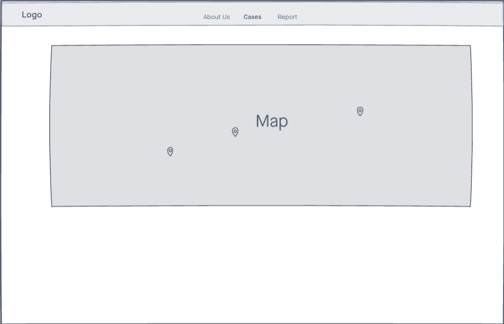

# Strategy
## Site owner's goals: 
To shed light on current and cold cases of missing people in Singapore and to provide a channel for tip-offs on these cases. 
# Users: 
1.General public
2.Friends/family members of missing people  
## User's goals: 
For general public to provide useful information that may help in the search of missing people.
For friends/family members of missing people to reach a wider audience(other parts of the world) in looking for missing person.

# Scope
## Functional:
1. Users can click on markers on a map to see the last seen locations and description of missing people.
2. Users can tip off, report cases with the option to insert images.
3. Users can read missing people news reports from local news outlets.
## Non-functional:
1. Mobile responsiveness
2. Reporting form is provided in thai, malay, mandarin.

# Structure

# Skeleton
## Main page: 

## About us page: 

## Cases page:

## Report page:

