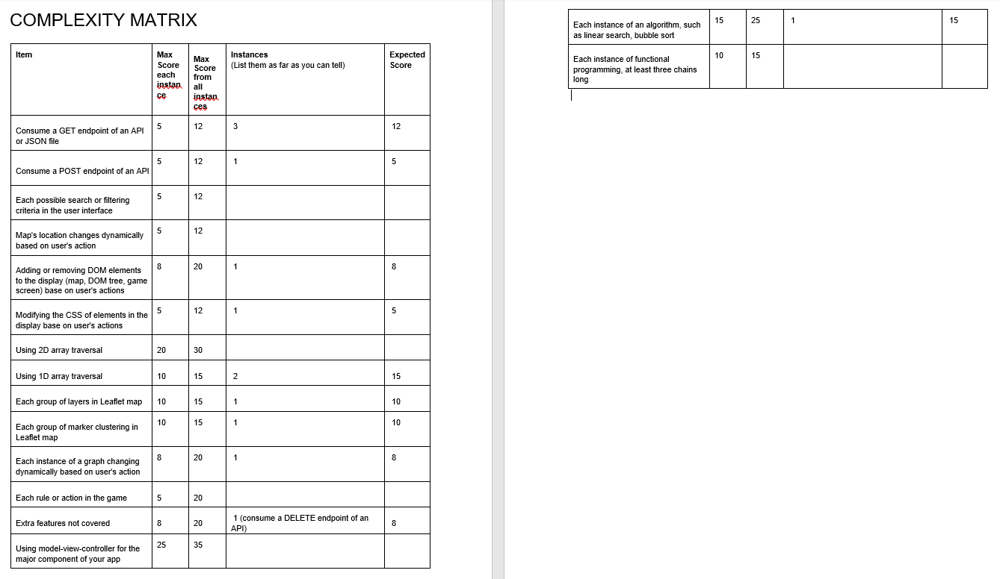

# Live URL
https://roowahoo.github.io/Assignment-1/

# Complexity Matrix

# Strategy
## Site owner's goals: 
To raise awareness of the major crimes that took place in Singapore, a country known for being one of the safest in the world to live in.
Also, to shed light on current and cold cases of missing people in Singapore and to provide a channel for reporting new cases. 
# Users: 
1. General public
2. Friends/family members of missing people  
## User's goals: 
The general public would want to be well-informed and aware of their own safety which can be very easily taken for granted considering we
are living in Singapore where laws and punishments for offenders are strictly enforced.

Apart from being aware of the chances of becoming a victim of crime themselves, there is a need for a convenient one-stop place
for current missing people reports that do not make it to the headlines. Users can then be on a look out for these missing people who
happened to be last seen in their vicinity.

For friends/family members of missing people, they would want to reach a wider audience(other parts of the world) in the search for
their loved ones especially when their case do not make it to the news headlines.

## User Stories
1. As a user, I want news from reliable sources on the topic of crime in Singapore so that I do not be deceived by fake news that is prevalent
in social media now.
Acceptance Criteria: Only articles from trusted local news outlets such as The Straits Times will be filtered and displayed.
2. As a user, I want relevant articles to be presented to me so that I do not have to sift through the internet for them myself.
Acceptance Criteria: Relevant articles will be filtered by keywords and displayed on a carousel.
3. As a user, I want data from reliable sources on the crime rates in Singapore so that I am well-informed by facts and statistics.
Acceptance Criteria: Data will be retreived from government sources such as that from Singapore Police Force.
4. As a user, I want these data to be in a summarised and readable format so that I can access them conveniently in a short time.
Acceptance Criteria: Data will be filtered and displayed on charts.
5. As a user, I want a quick way to publish my missing report so that I can get information out quickly without having to go through
tedious processes when I am already desperate.
Acceptance Criteria: Form should be easy to fill in and submit and should only ask for relevant information that contributes to improving
the quality of search.

# Scope
## Functional:
1. Users can click on markers on a map to get a summary of  what took place at the location.
2. Users have the option to read more with links to articles without having to search for themselves.
3. Users are presented with crime statistics in an easy-to-infer format such as a bar graph.
4. Users can report their cases easily for publishing on the webpage.
5. Users can read relevant news articles from local news outlets.

## Non-functional:
1. Mobile responsiveness
2. Privacy of users posting cases (no personal information is requested and published on the web)

# Structure

## Information architecture
### Content Inventory
1. News articles
2. Images of missing people
3. Dataset for murders in Singapore

### Interaction design
1. Understandability: Content have short headings for quick understanding and forms have clear input titles.
2. Learnability: Navigation links are positioned at the top where users are familiar with and are consistent throughout the pages.
Cursors and font color changes on links on hover to indicate that it is clickable.
3. Operability: 
- Links to external news sources are working
- Forms are working and display an error message when submission fails
4. Attractiveness: 
- Padding and margin are present to improve readability
- Font size and layout changes according to screen size to improve readability. This was achieved with the use of media queries and
the Bootstrap grid system.

# Skeleton
## Main page (web): 

## Main Page (mobile):

## About us page: 

## Cases page:

## Report page:

### Interface design
Each page consists of a navigation bar and main content section.
Home page: Includes current informational news on a carousel and charts.
About Us page: Identifies goals of the web page and content you can expect from it.
Cases page: Includes a map that marks out crime scenes of notorious cases as well as last seen locations of missing people. 
Pop-ups showing more details of these cases on click.
Report page: Includes a form for user to post their own cases and displays cases posted by others.

### Navigation design(bootstrap components)
1. Fixed navigation bar on top of every page and highlighted depending on active page that user is on.
2. Logo brings you to home page on click.
3. Colapsible hamburger menu on smaller screens

# Surface
## Visual design
1. Colour
As the web page is based on a solemn topic of homicides and missing people, the main color palette chosen were muted colours
like white, gray and pastels specifically for the bar chart.
2. Fonts
Main font chosen resembles that of a typewriter and is easy on the eyes of the reader.
3. Logo
Clean logo design clearly communicates purpose of the web page and abstract background of the logo symbolizes the element of mystery in
some cases.

# Features
## News carousel
Latest relevant news from local news outlets are fetched from a news api and displayed on a bootstrap carousel. It is however, limited to 100 
requests per day on the free plan.
Links to the external news sources are made available on the carousel.
## Chart
ApexCharts is used to display datasets retreived from [data.gov](data.gov.sg) 
## Map
Leaflets map is used to mark out significant locations where notorious crime cases took place.
A card pop-up on click displays an image and summarised details of what took place.
Buttons on the cards bring users to the external news source for further reading.
## Form
Form allows users to create and post their own cases which will then be displayed on a mock bulletin at the bottom.

# Technologies and Credits
HTML5, CSS3 and Javascript were used in this project.

[Gitpod](www.gitpod.io) was the main coding platform and [Repl.it](repl.it) as a temporary testing platform when Gitpod was down.

[GitHub](github.com) was used for repositories.

[Bootstrap 5](https://getbootstrap.com/docs/5.0/getting-started/introduction/) was used for it's starter template, navigation bar, 
carousel and cards. Bootstrap CSS was used when it made more sense to.

[InVision](invisionapp.com) was used for drawing skeleton.

[Lucid](lucid.app) was used for drawing structure.

[Canva](www.canva.com) was used for creating the logo.

[Google maps](https://www.google.com.sg/maps) was used to get the lat long for map markers.

[Google fonts](https://fonts.google.com/) was used to get Benne,Serif font

[Leaflets](https://leafletjs.com/) was used to display the map in cases page.

[Gnews](https://gnews.io/) was used to fetch news articles on the main page carousel.

[ApexCharts](https://apexcharts.com/) was used to display datasets on main page.

[Paul's Github](https://github.com/kunxin-chor?tab=repositories) was used as reference to recreate code that has been taught in class.

Benjamin's missing cases API which he helped me to deploy on [Heroku](www.heroku.com) was used to fetch and post cases. 
[MongoDB](www.mongodb.com) was used for his database.

Images and articles referenced from [The Straits Times](https://www.straitstimes.com/), [Mothership](https://mothership.sg/), [Yahoo](https://sg.news.yahoo.com/), 
[NLB](eresources.nlb.gov.sg), [AsiaOne](www.asiaone.com), [MustShareNews Youtube](www.youtube.com/watch?v=jJ13K41HUw4&ab_channel=MustShareNews), 
[The Independent](theindependent.sg).

'Missing' header image from [iStock](https://www.istockphoto.com/illustrations/missing-persons)

Thumbtack icon from [Font Awesome](https://fontawesome.com/icons/map-pin?style=solid)

# Testing
## Report form submission
1. Click on 'reports'
2. Enter details into form
3. A submission with empty feilds will prompt an alert 'Please enter all fields'
3. Click 'submit' and reload page to see new case created below
4. A failed submission due to internal errors will prompt an alert 'Failed to add case'

## Delete button check
1. At reports page, click 'delete' on any case
2. Case will be deleted from the page

## Navigation check
1. Click on any/all links on the navigation bar to take you to your desired page

## Hyperlink check
1. Go to the main page by clicking on the logo
2. In the news carousel, hover over the title and click 
3. Return and go to cases
4. Select any marker on the map and click on 'read more'

# Deployment
1. Navigated to settings of assignment repository
2. Selected 'branch:master'
3. Save to be published

